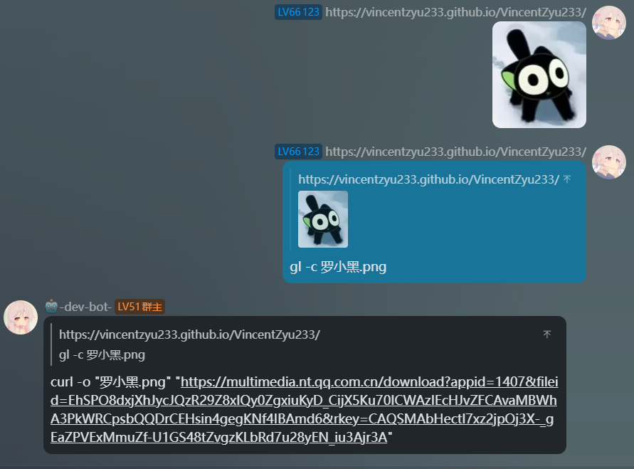
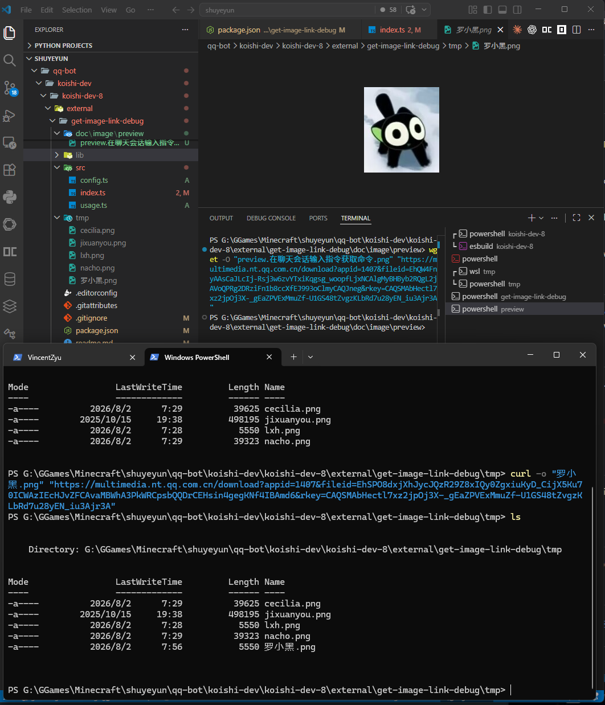

# 🖼️ koishi-plugin-get-image-link-debug

[](https://www.npmjs.com/package/koishi-plugin-get-image-link-debug)
[](https://www.npmjs.com/package/koishi-plugin-get-image-link-debug)

[](https://github.com/VincentZyuApps/koishi-plugin-get-image-link-debug)
[](https://gitee.com/vincent-zyu/koishi-plugin-get-image-link-debug)

[](https://forum.koishi.xyz/t/topic/xxxxx)

[](https://qm.qq.com/q/ZN7fxZ3qCq)

<h2>💬 交流反馈</h2>
<p>🐛 Bug 反馈 / 💡 建议 / 👨‍💻 插件开发交流，欢迎加群：</p>
<p><del>💬 插件使用问题 / 🐛 Bug反馈 / 👨‍💻 插件开发交流，欢迎加入QQ群：<b>259248174</b>（这个群G了）</del></p>
<p>💬 插件使用问题 / 🐛 Bug反馈 / 👨‍💻 插件开发交流，欢迎加入QQ群：<b>1085190201</b> 🎉</p>
<p>💡 在群里直接艾特我，回复得更快哦~ ✨</p>

一个简洁的 Koishi 调试插件，用于提取消息中的图片或 `mface` 原始链接，并生成 wget、curl 下载命令。

## 🚀 使用方法

默认命令为 `get-link`，别名为 `gl`。可以回复带图片的消息、将图片附在命令后，或只发送命令后在 30 秒内按提示发送图片。

```text
gl                         # 输出图片链接
gl -w image.png            # 生成 wget 下载命令
gl --wget image.png        # wget 的长选项写法
gl -c image.png            # 生成 curl 下载命令
gl --curl image.png        # curl 的长选项写法
```

生成的下载命令示例：

```shell
wget -O "image.png" "https://example.com/image.png"
curl -o "image.png" "https://example.com/image.png"
```

## 📸 效果预览

在聊天会话中回复图片并执行命令，机器人会返回可直接使用的下载命令：



将命令粘贴到终端，即可把图片下载到当前文件夹：



## ⚙️ 配置项

| 配置项 | 默认值 | 说明 |
| --- | --- | --- |
| `commandName` | `get-link` | 命令名称 |
| `commandAlias` | `gl` | 命令别名 |
| `enableRegisterCommand` | `true` | 是否注册命令 |
| `enableQuote` | `true` | 回复结果时是否引用原消息 |
| `enableCodeBlock` | `false` | 是否用代码块包裹下载命令 |

## ⚠️ 注意事项

- wget 和 curl 选项只生成命令行指令，不会由机器人执行下载。
- 消息中有多张图片时，普通模式会输出全部链接，下载命令使用第一张图片。
- 平台提供的临时图片链接可能会过期，请及时使用。

<a id="wget-curl-installation"></a>

## 🧰 wget 与 curl 命令行工具

本插件只生成下载命令，不会替用户安装工具或执行下载。请根据自己的终端环境准备 wget 或 curl。

### 🪟 Windows

Windows 10/11 通常自带 `curl.exe`；wget 与可选的新版 curl 均可通过 [Scoop](https://scoop.sh/) 安装。PowerShell 建议显式使用 `.exe`，避免命令别名干扰。

Windows PowerShell 5.1 默认将 `wget` 和 `curl` 设为 `Invoke-WebRequest` 的别名；PowerShell 7 通常会直接解析真实程序。原生下载写法为 `Invoke-WebRequest -Uri "URL" -OutFile "image.png"`。

```powershell
scoop install wget
scoop install curl # 可选，系统自带 curl.exe 时通常无需安装
Get-Command wget,curl -All
wget.exe --version
curl.exe --version
```

在 CMD 中使用 `where` 查看可执行文件路径；PowerShell 应使用上面的 `Get-Command`，或显式调用 `where.exe`。

```cmd
where wget
where curl
wget --version
curl --version
```

### 🐧 Linux / WSL

| 发行版 | 安装命令 |
| --- | --- |
| Debian / Ubuntu 系 | `sudo apt update && sudo apt install -y wget curl` |
| Fedora / RHEL 系 | `sudo dnf install -y wget curl` |
| Arch Linux 系 | `sudo pacman -S wget curl` |
| Arch Linux 系（paru） | `paru -S wget curl` |
| Alpine Linux | `apk add wget curl` |

WSL 直接使用所安装发行版对应的命令；`paru` 适合已经安装 AUR helper 的环境，官方仓库包优先使用 `pacman`。

### 🍎 macOS

macOS 自带 curl，通常只需执行 `brew install wget`。`brew install curl` 可安装较新版本，但该包通常为 keg-only，不会自动替换系统 curl。

### 📱 Android / Termux

Termux 使用 `pkg update && pkg install wget curl`，不要使用 Alpine Linux 的 `apk`。

#### ✅ 验证安装

> 以下命令适用于 Linux、macOS 和 Android / Termux；若精简系统未提供 `which`，请使用 `command -v`。

```bash
command -v wget
command -v curl
which wget
which curl
wget --version
curl --version
```
